# Octoplan + Octogent: the complete how-to

**Octoplan** helps you *plan* a project with Claude: it asks you clear questions, one card at a time, and writes the answers down as a plan.
**Octogent** helps you *build* it: a team of Claude agents ("tentacles"), each with its own to-do list, coordinated by one "octopus".

You plan in Octoplan, hand the plan over to Octogent, and watch the agents build it. This guide walks through every screen, from a brand-new idea (or a half-finished project) all the way to agents writing code.

> Prefer watching? The tutorial video is `docs/octoplan/tutorial/octoplan-v3-tutorial.mp4` (about 4½ minutes).

---

## Contents

1. [What you need](#1-what-you-need)
2. [Start both apps](#2-start-both-apps)
3. [The big picture: seven steps](#3-the-big-picture-seven-steps)
4. [Step 1 — Start: a new idea or something that exists](#4-step-1--start)
5. [Step 2 — Understand: check what Claude read](#5-step-2--understand)
6. [Step 3 — Interview: answer question cards](#6-step-3--interview)
7. [Step 4 — Goal: the definition of done](#7-step-4--goal)
8. [Step 5 — Stages: build prompts](#8-step-5--stages)
9. [Step 6 — Hand off to Octogent](#9-step-6--hand-off-to-octogent)
10. [Step 7 — Build: Octogent and its agents](#10-step-7--build)
11. [Closing the loop: what the agents decided](#11-closing-the-loop)
12. [Everything else in Octoplan](#12-everything-else-in-octoplan)
13. [Where things are saved](#13-where-things-are-saved)
14. [Keyboard cheat sheet](#14-keyboard-cheat-sheet)
15. [Troubleshooting](#15-troubleshooting)

---

## 1. What you need

| You need | Why | Check |
|---|---|---|
| **Node.js 22+** and **pnpm** | Both apps are Node apps | `node -v`, `pnpm -v` |
| **Claude Code**, logged in | Octoplan and the agents *are* Claude Code | `claude` opens without asking you to log in |
| **git** | Projects are git repos; the history feeds "harvest" | `git --version` |
| **The octogent repo** | Octoplan lives inside it (`apps/octoplan`) | `git clone https://github.com/KreenoHub/octogent` |
| **The `octogent` command** | For the "Run Octogent" button | In the octogent repo: `pnpm install && pnpm build && npm install -g .` |
| *(optional)* **GitHub CLI** `gh` | Pull-request badges on tentacle cards | `gh auth status` |

Nothing leaves your computer except what Claude Code itself sends. Both apps only listen on `127.0.0.1`.

## 2. Start both apps

**Octoplan** — from the octogent repo:

```bash
pnpm install
pnpm --filter @octogent/octoplan dev
```

Open **http://127.0.0.1:5190**. (The server itself runs on port 8790.)

**Octogent** — you don't have to start it yourself: Octoplan's **Run Octogent** button does it for you in the right folder (see [step 7](#10-step-7--build)). If you'd rather do it by hand: `cd` into your project and run `octogent`. It opens its dashboard in the browser, usually at http://127.0.0.1:8787 (the next free port if that's taken).

## 3. The big picture: seven steps

Once a project is open, a bar across the top shows where you are:

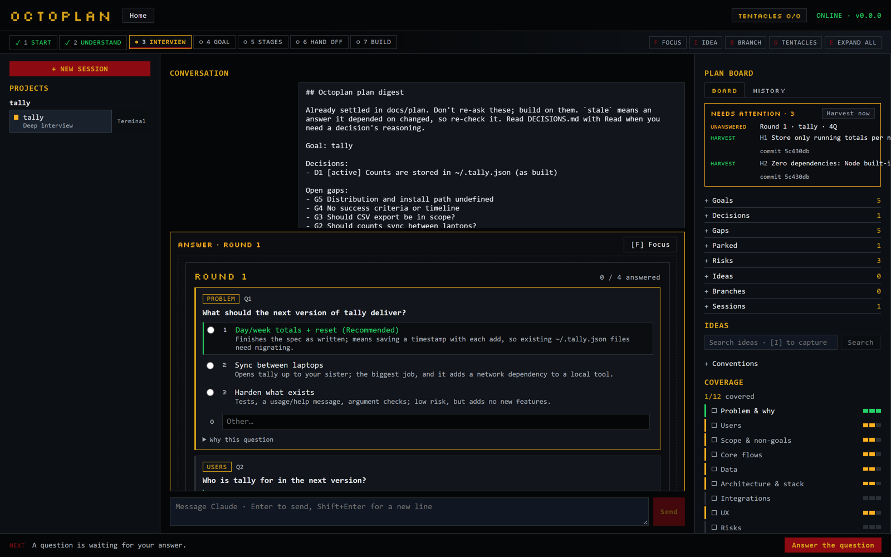

| # | Step | What happens | Done when |
|---|---|---|---|
| 1 | **Start** | Pick a project, or make one (goes to the Home screen) | a project is open |
| 2 | **Understand** | Only for imports: check what Claude understood from your files | you applied the import (skipped for new projects) |
| 3 | **Interview** | Claude asks question cards; you answer | every topic is at least partly covered, or the goal is written |
| 4 | **Goal** | Claude writes `GOAL.md`: goals, non-goals, a checkable definition of done | GOAL.md has done-when items |
| 5 | **Stages** | The plan becomes step-by-step build prompts | stages exist |
| 6 | **Hand off** | The plan becomes Octogent tentacles and to-dos | the handoff is applied |
| 7 | **Build** | Octogent's agents work; you watch the progress | every handed-off to-do is ticked |

Each step shows ✓ done, ● current, ○ still to come, or – skipped. Hover a step to see *why*.

**Steps never lock you out.** Click any step at any time to look at it.

**The bar at the bottom always shows your next move** — one button: *Answer the question*, *Ask Claude to write GOAL.md*, *Generate stages*, *Hand off to Octogent*, *Run Octogent*, *Open Octogent*. If you're ever unsure what to do, press that button.

---

## 4. Step 1 — Start

Octoplan opens on **Home** when you have no projects yet. Later, the **Home** button (top left) brings you back.

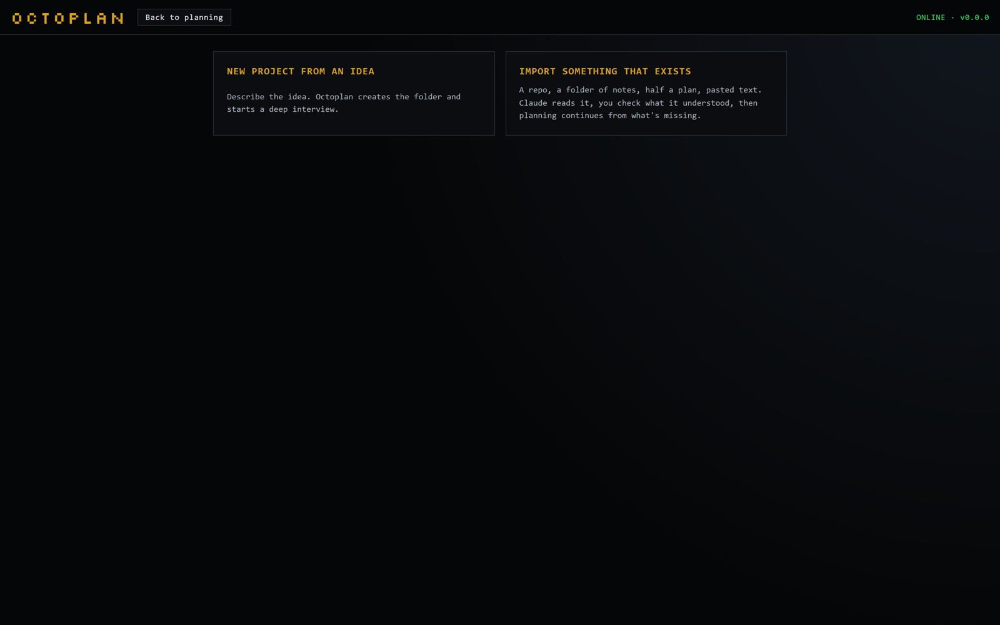

You get two big choices, plus your recent projects underneath.

### A. New project from an idea

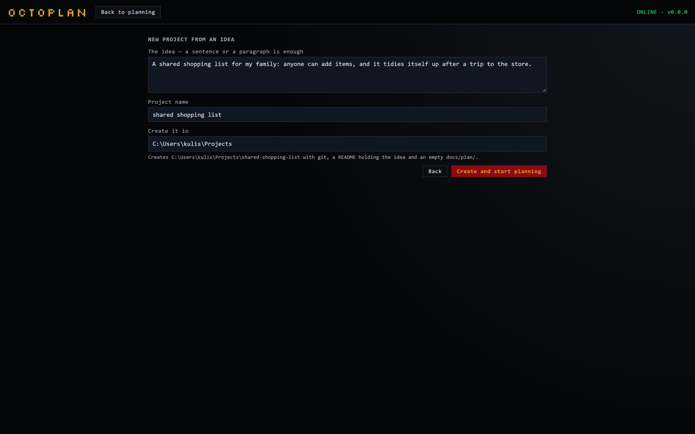

1. **Describe the idea** — a sentence or a paragraph is enough.
2. **Project name** — suggested from your idea; change it if you like. Any language works (a Hebrew name makes a Hebrew folder name).
3. **Create it in** — the parent folder. It defaults to where your latest project lives.
4. Press **Create and start planning**.

Octoplan then:
- creates `<parent>/<name>` (it refuses if that folder exists and isn't empty),
- sets up **git** with one first commit,
- writes a **README.md** holding your idea and an empty **docs/plan/** folder,
- starts a **Deep interview** — the first question card appears within seconds.

The Understand step is skipped for new projects (there's nothing to read yet).

### B. Import something that exists

Use this when you already have *something*: a repo, a folder of notes, half a plan, a spec in Google Docs you can paste, a chat log…

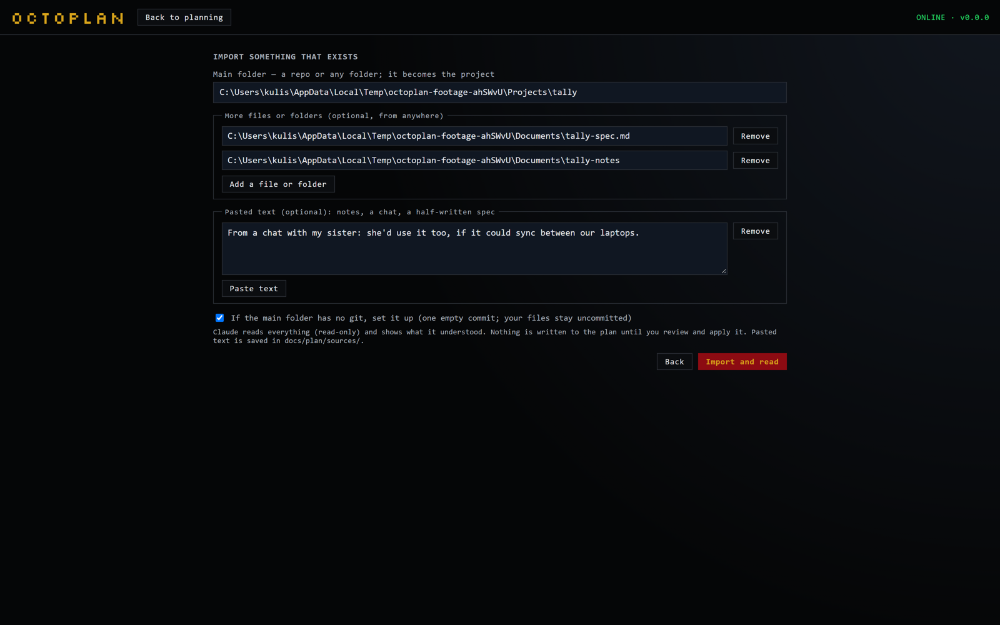

1. **Main folder** — a repo or any folder. **It becomes the project.** Tip: in Windows Explorer, Shift+right-click → *Copy as path* and paste; the quotes are removed for you.
2. **More files or folders** *(optional)* — add as many as you like, from anywhere on your computer: a spec in Documents, a notes folder, a single file. They are **read, not copied**.
3. **Pasted text** *(optional)* — notes, a chat, a half-written spec. Each paste is saved to `docs/plan/sources/pasted-1.md`, `pasted-2.md`…
4. **Set up git** *(on by default)* — if the main folder isn't a git repo yet, Octoplan runs `git init` with one **empty** commit. Your own files are **not** committed; that's up to you.
5. Press **Import and read**.

What gets read:
- Claude reads **plans and docs first** (READMEs, `.md`, `.txt`, specs, PDFs), then manifests like `package.json`, and code only as much as it needs to judge what's built.
- Octoplan never shows Claude dependencies, build output, lockfiles or binaries (`node_modules`, `dist`, `.git`, …).
- **Word, PowerPoint, Excel files and images can't be read.** They're listed as *not read* in the review, so you know to paste their text if they matter.
- Big folders are capped at 400 listed files (docs first).
- It's **read-only**: Claude can't change your files during an import.

## 5. Step 2 — Understand

While Claude reads (usually under a minute), the Understand step shows a spinner. You can leave and come back; the draft is saved.

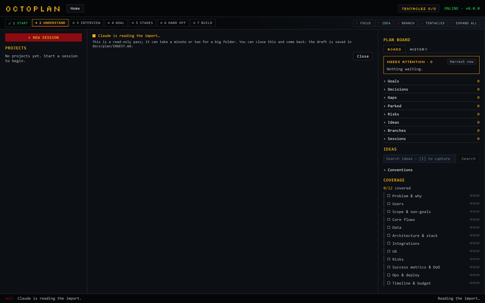

Then you get **What I understood**:

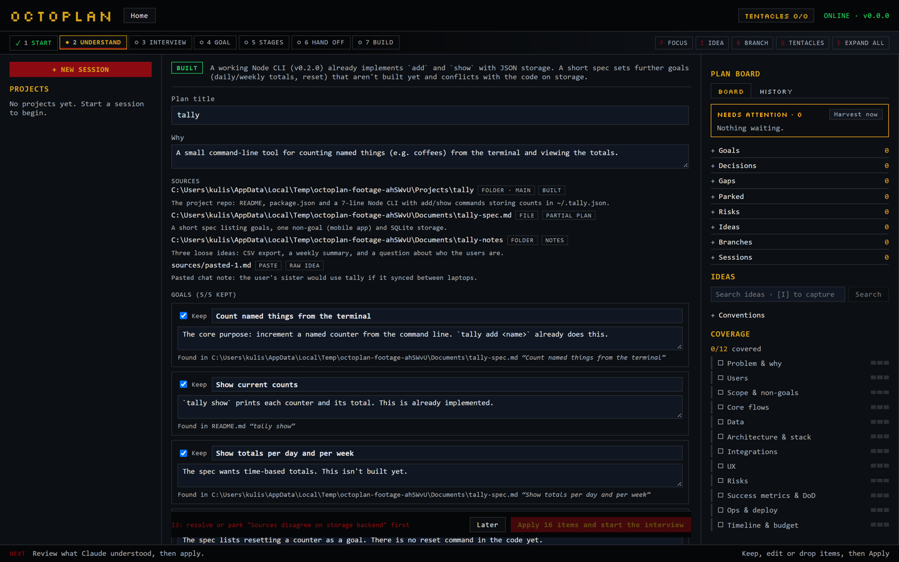

- **Maturity** (top): how far along your material is —
  - **Raw idea** — a sentence or a few lines,
  - **Notes** — scattered thoughts,
  - **Partial plan** — some goals or decisions, big holes,
  - **Detailed plan** — mostly settled,
  - **Built** — working code exists.
  Each source gets its own rating too. The maturity decides how the interview starts (a detailed plan gets fewer questions; a built project is asked "what's next?").
- **Plan title** and **Why** — edit them freely.
- **Sources** — every folder, file and paste, with Claude's one-line note and its maturity.

Below that, the items Claude found, grouped into **Goals, Non-goals, Decisions, Gaps and Risks**:

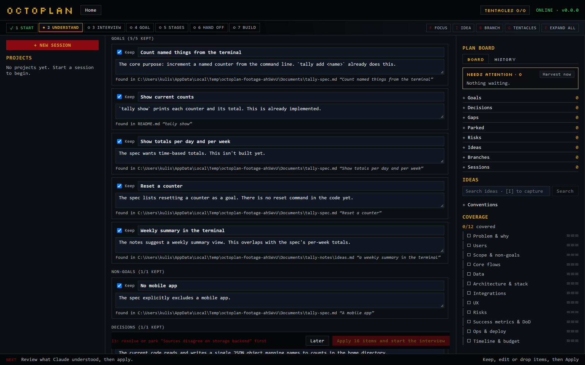

For every item you can:
- **Keep** or un-tick it to **drop** it,
- **edit** its title and details,
- see its **evidence**: *Found in `file` "exact quote"* — or *Inferred: reason* when Claude concluded it itself.

Special cases:
- **Assumption** badge — an inferred goal, non-goal or decision. If you keep it, it's also written down as a risk ("Assumed on import: …") so the interview can confirm it.

  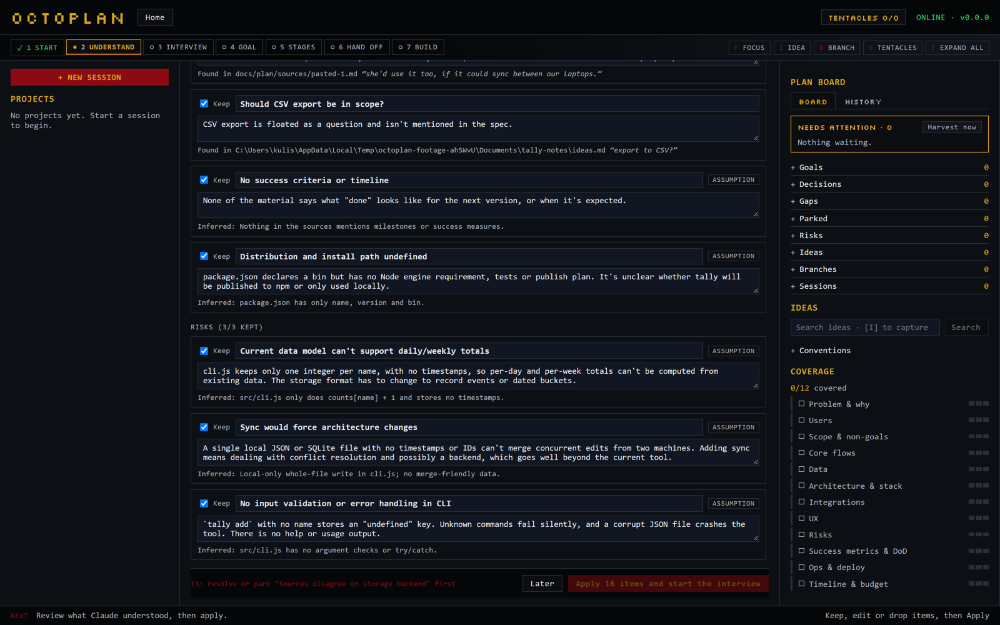

- **Already in plan (D3)** — the item matches something your plan already has. It's shown for context and never written twice.
- **Sources disagree on …** — two of your sources contradict each other (here: the notes say JSON, the spec says SQLite). You must settle it before applying:
  - **Resolved** — edit the details to the answer; it becomes a decision.
  - **Parked** — "ask me in the interview"; Claude will bring it up.

  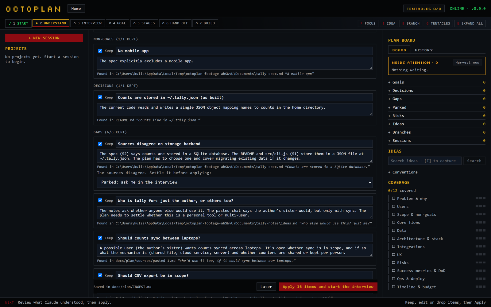

Edits save automatically. **Later** closes the review (it stays in the Understand step and on Home as "import waiting for review"). When you're happy, press **Apply N items and start the interview**.

Apply writes the kept items into your plan (`docs/plan/`), marks the import as applied, and starts an interview that **only asks about what's still open** — the gaps, the parked disagreements and the weak topics — and never re-asks what you kept. For a built project it also scans the git history for decisions ("harvest").

Importing again later adds the new sources and shows only the new items.

## 6. Step 3 — Interview

This is the heart of Octoplan. Claude asks **rounds** of question cards in the **answer dock**, which never scrolls away:


On each card:
- pick an option (**1–9** or click). **(Recommended)** marks Claude's suggestion,
- **O** or the *Other…* box — type your own answer,
- **T** — mark your answer **tentative** (unsure; it's also recorded as a risk),
- **P** — **park** it: "decide later", with an assumption Claude can work with,
- **Why this question** — Claude's reasoning,
- **Enter** — confirm the round.

After you answer, the round folds into short **answer chips**. Click a chip to **revise** an answer; Claude is told, and anything that depended on it is flagged.

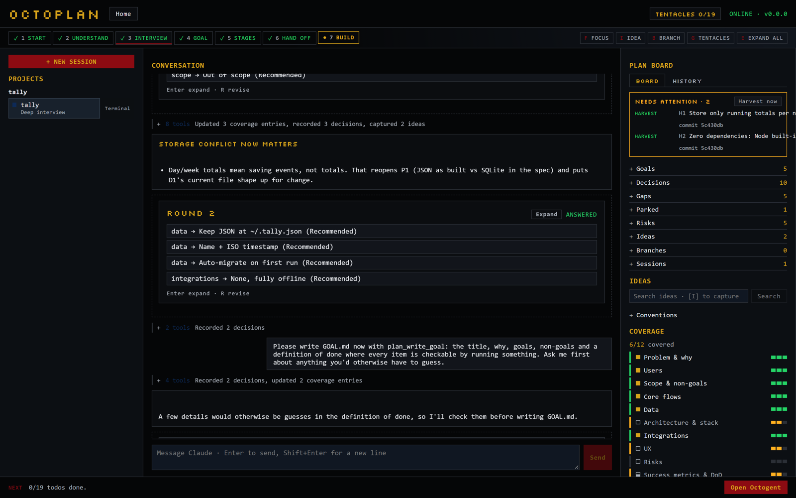

Meanwhile the **plan board** on the right fills in by itself: Goals, Decisions, Gaps, Parked, Risks, Ideas, and **Coverage** — twelve planning topics (problem, users, scope, flows, data, architecture, integrations, UX, risks, success, ops, timeline) that turn from empty to partial to covered.

**Focus mode** (press **F**) shows just the question, big and centered — for "just let me answer":

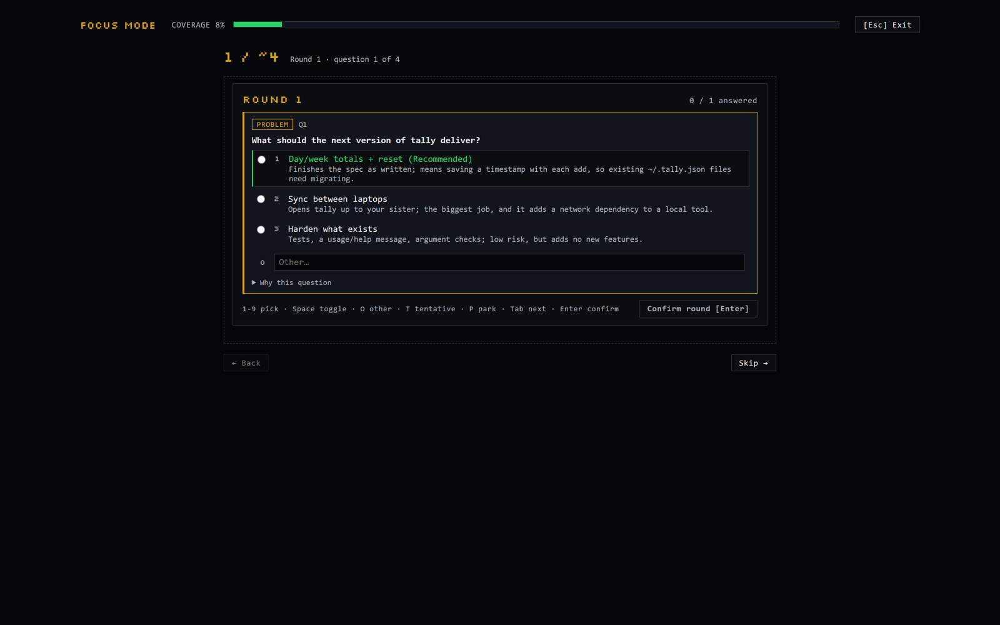

You can also type to Claude at any time in the box under the conversation.

## 7. Step 4 — Goal

When the topics are covered, the next-action bar says **Ask Claude to write GOAL.md**. Press it: Claude writes the goal — title, why, goals, non-goals and a **definition of done** where every item is checkable by running something (a command, a test, a screen). It may ask a last question or two first.

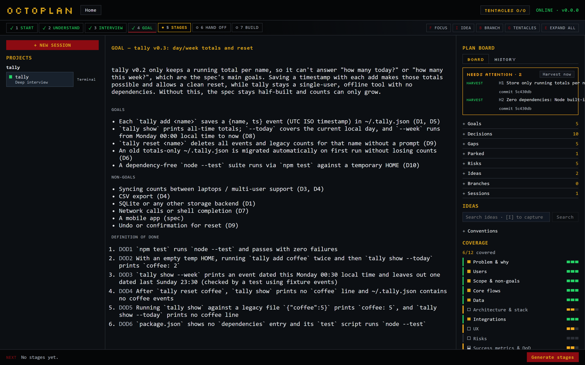

## 8. Step 5 — Stages

**Generate stages** turns the goal and decisions into step-by-step **build prompts** — one per stage, each self-contained, each ending with a testing checkpoint. **Copy prompt** puts one on your clipboard if you want to paste it into any Claude session yourself.

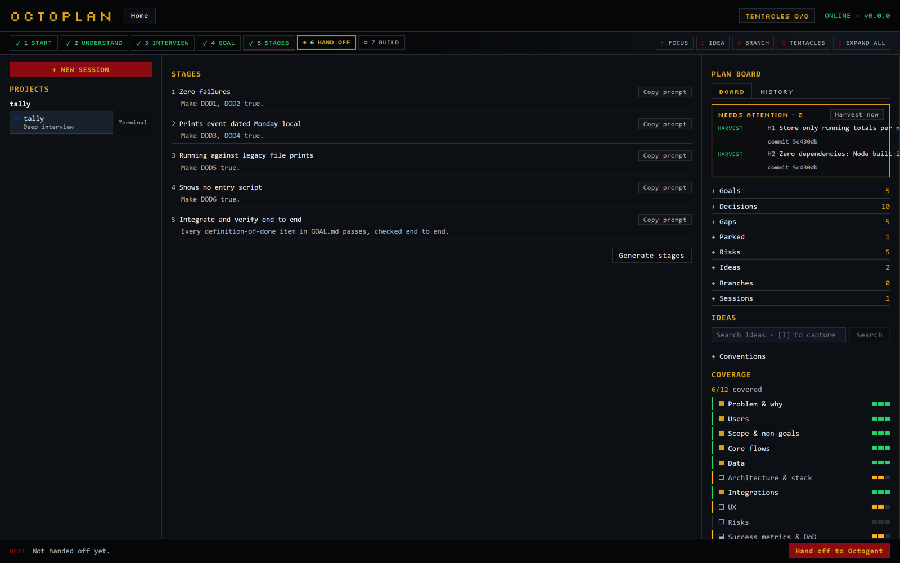

## 9. Step 6 — Hand off to Octogent

The **Hand off** step turns the plan into Octogent **tentacles** (workstreams) with to-do lists, in four steps:

1. **Generate** — Claude proposes how to split the work: 3–8 tentacles, each owning certain folders, each with one-line to-dos that end in "Done when…" and cite the decision they come from (like `[D12]`). Pick the **to-do heading** first (default: your plan's title).

   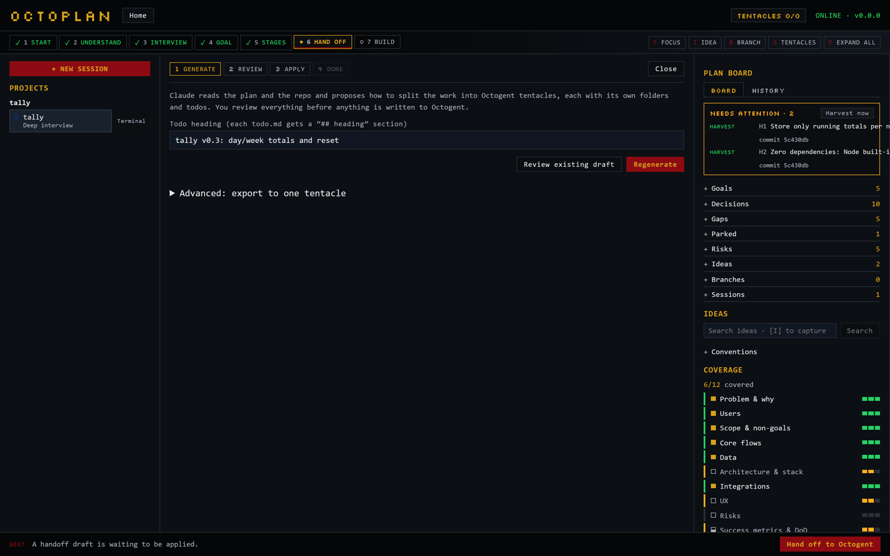

2. **Review** — rename, add or remove tentacles; change which folders they own; edit, move or delete to-dos. Saved automatically to `docs/plan/HANDOFF.md`.

   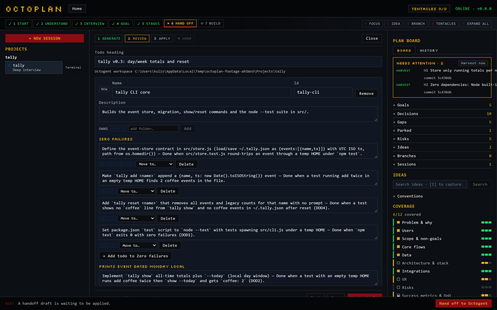

3. **Apply** — creates the missing tentacles in Octogent and writes their to-dos. Applying twice never duplicates anything, and your own notes in a tentacle's `CONTEXT.md` are never touched.
4. **Done** — per-tentacle results, **Open Octogent**, and the **octopus prompt** with a **Copy** button (also saved as `docs/plan/OCTOPUS.md`).

**Octogent must be running in that folder for Apply to work.** If it isn't, you'll see exactly that — with the fix right there:

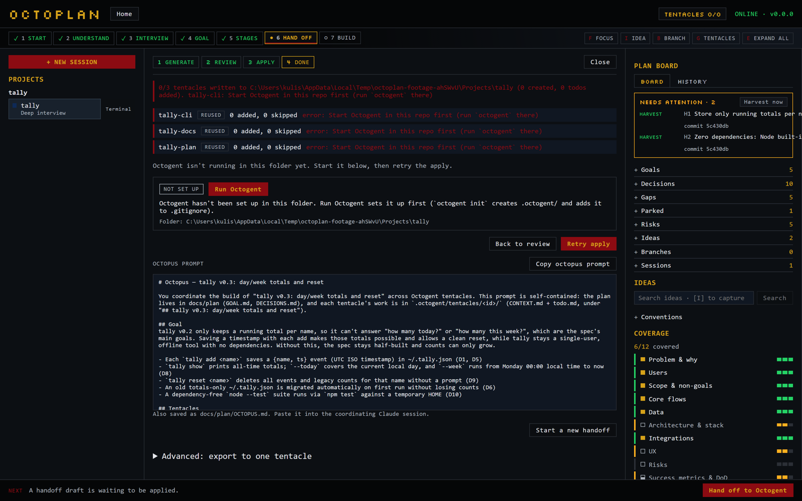

Press **Run Octogent**, wait for **Running :port**, then **Retry apply**.

*Advanced:* "Export to one tentacle" (under the wizard) writes chosen tasks into a single tentacle instead of the full split.

## 10. Step 7 — Build

### Run Octogent

**Run Octogent** (in the Build step, in the handoff, or in the bottom bar):
- runs `octogent init` first if the folder has never used Octogent (it creates `.octogent/` and adds it to `.gitignore`),
- opens a **terminal window** running `octogent` in your project folder (Windows Terminal on Windows 11, Terminal on macOS),
- waits until Octogent reports its **real port**, then shows **Running :port** and **Open Octogent**.

If Octogent is already running, the button just becomes **Open Octogent** — it never starts a second copy. If no terminal can be opened, it shows the exact command with a **Copy** button. Closing Octoplan leaves Octogent running.

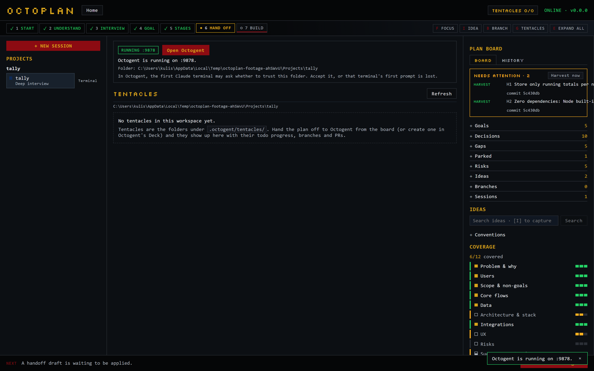

The Build step then shows each tentacle as a card with its progress:

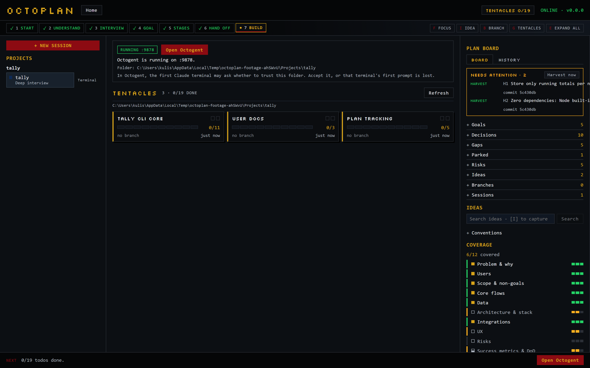

### In Octogent

Octogent's views are numbered — press **1–8** to switch.

**[2] Deck** — one card per tentacle: its description, its to-do list with progress (`3/12 done`), and buttons: **Spawn** (start an agent on this tentacle), **Skills**, **Vault** (its files: `CONTEXT.md`, `todo.md`).

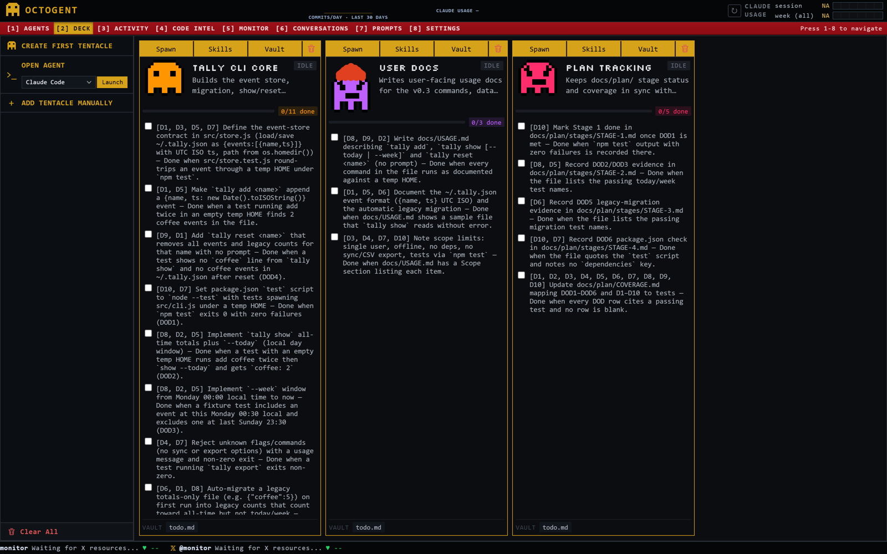

**[1] Agents** — the octopus in the middle, tentacles around it. Terminals of running agents open from here.

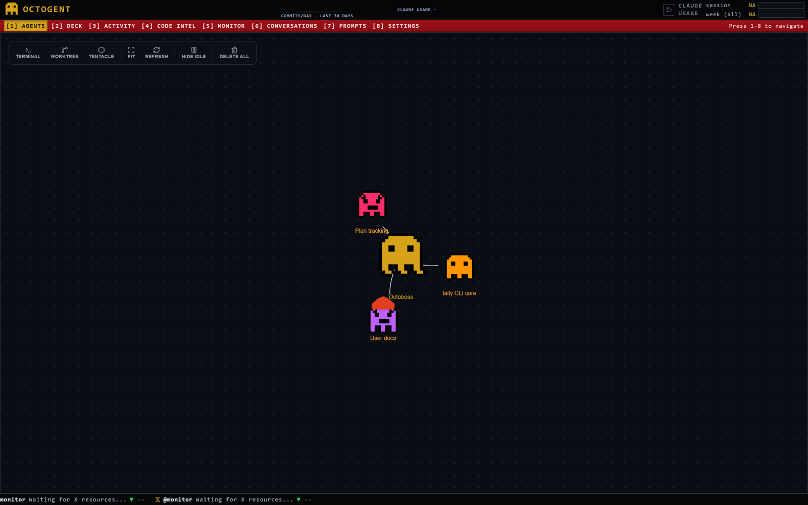

Click a tentacle to open its panel: **Create Agent** starts one Claude agent on it; **Spawn Swarm** starts several (in separate worktrees, or sharing the folder) for a long list. Below that is the tentacle's checklist.

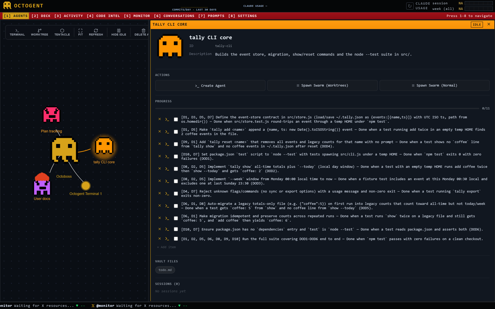

**Start the work:**
1. Open the **octopus** (the coordinator in the middle of the Agents view) and paste the **octopus prompt** you copied from Octoplan's Done step. It knows every tentacle, the order of the waves, and the rules (each agent stays in its own folders; commits cite decision ids).
2. The octopus spawns an agent per tentacle (or press **Spawn** / **Create Agent** yourself).
3. **First time in a folder:** Claude Code asks whether to **trust this folder**. Accept it — otherwise that terminal's first prompt is lost.
4. Watch the to-dos tick off on the Deck — and in Octoplan's Build step and the **Tentacles n/m** header button.

This is what it looks like when the agents are done — a real project (Octoplan itself), planned in Octoplan and built by Octogent's agents, every to-do ticked:

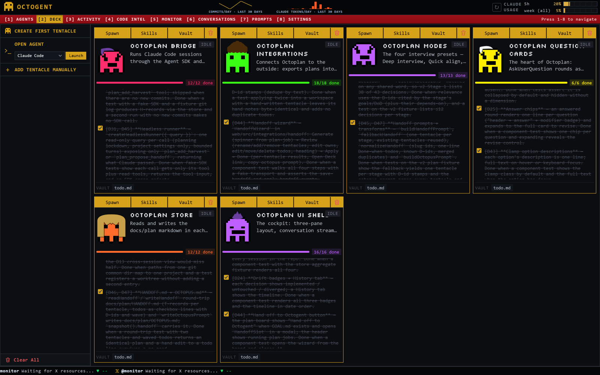

## 11. Closing the loop

Agents make decisions while building. Octoplan catches them:
- **Harvest** reads new commits and to-do changes (automatically when you open the project, or with **Harvest now**) and proposes decisions in **Needs attention**. Accept or reject each one; rejected ones never come back.
- **Drift badges** on decisions show *implemented*, *untouched* or *diverged*, based on the decision ids in commits and to-dos.
- The board's **History** tab shows how the plan evolved.

So the plan stays true while the code moves.

## 12. Everything else in Octoplan

| Feature | How | What it's for |
|---|---|---|
| **Sessions & modes** | *+ New session* (left sidebar) | Start another conversation on the same project: **Deep interview** (thorough), **Quick align** (a few fast rounds), **Brainstorm** (ideas board), **Devil's advocate** (Claude pokes holes) |
| **Idea capture** | **I** | Jot an idea without leaving the conversation; it lands in *Ideas* |
| **Idea search** | Board → Ideas → Search | Find ideas across all your projects |
| **Brainstorm board** | In a Brainstorm session | Star, park, kill, merge or adopt ideas; **Converge** turns starred ones into decisions |
| **Branch** | **B** | Fork the conversation to explore "what if…" without losing the main line |
| **Tentacles overview** | **G**, or the *Tentacles n/m* header button | Pixel tentacle cards with progress, branches and PR status; the git graph as drill-down |
| **Expand all** | **E** | Unfold every collapsed summary, tool call and answered round |
| **Conventions** | Board → Conventions | Personal rules that apply to every project (saved in `~/.octoplan/CONVENTIONS.md`) |
| **Terminal** | *Terminal* next to a session | Open that Claude session in a real terminal |
| **Sessions survive restarts** | automatic | A question you hadn't answered comes back after a restart |

Every hotkey also has a button in the toolbar at the top right.

## 13. Where things are saved

Everything is plain markdown in your project, so you can read it, edit it and commit it:

| File | What |
|---|---|
| `README.md` | Your idea (new projects) |
| `docs/plan/GOAL.md` | Title, why, goals, non-goals, definition of done |
| `docs/plan/DECISIONS.md` | Numbered decisions (D1, D2, …) with where they came from |
| `docs/plan/GAPS.md`, `RISKS.md`, `PARKED.md` | Open questions, risks (incl. tentative answers and assumptions), parked answers |
| `docs/plan/COVERAGE.md` | The twelve planning topics |
| `docs/plan/IDEAS.md`, `branches.md` | Ideas and conversation branches |
| `docs/plan/INGEST.md` | The import review ("What I understood") |
| `docs/plan/sources/` | Your pasted text |
| `docs/plan/sessions/` | A log of every session's questions and answers |
| `docs/plan/stages/STAGE-n.md` | Build prompts |
| `docs/plan/HANDOFF.md`, `OCTOPUS.md` | The handoff plan and the octopus prompt |
| `docs/plan/HARVEST.md` | Decisions found in commits, waiting for review |
| `.octogent/tentacles/<id>/` | Octogent: each tentacle's `CONTEXT.md` and `todo.md` |

## 14. Keyboard cheat sheet

**Octoplan**

| Key | Does |
|---|---|
| F | Focus mode |
| I | Capture an idea |
| B | Branch the conversation |
| G | Tentacles overview / git graph |
| E | Expand / collapse everything |
| Esc | Close |

**On a question card:** `1–9` pick · `Space` toggle · `O` other · `T` tentative · `P` park · `Tab` next question · `Enter` confirm.

**Octogent:** `1` Agents · `2` Deck · `3` Activity · `4` Code intel · `5` Monitor · `6` Conversations · `7` Prompts · `8` Settings.

## 15. Troubleshooting

| You see | Do this |
|---|---|
| **"The `octogent` CLI isn't on PATH"** | Install it: in the octogent repo, `pnpm install && pnpm build && npm install -g .`, then press Run Octogent again |
| **Apply says "Start Octogent in this repo first"** | Press **Run Octogent**, wait for *Running*, then **Retry apply** |
| **"Octogent's process is alive, but :port isn't answering"** | Look at the Octogent terminal window — it may still be starting, or show an error |
| **An agent's first prompt did nothing** | It was waiting on the *trust this folder* question. Accept it in that terminal and send the prompt again |
| **The import takes long** | Big folders take a couple of minutes. You can close the review and come back; it's saved |
| **"Resolve or park … first"** | A *Sources disagree* item is still open: choose *Resolved* or *Parked* (or untick it) |
| **A file shows as "Not read"** | It's a Word/PowerPoint/Excel file or an image. Copy its text into a new import as pasted text |
| **I can't find my import** | Home → Recent projects → the project marked "import waiting for review" |
| **Octoplan says it's offline** | The Octoplan server stopped. Run `pnpm --filter @octogent/octoplan dev` again; sessions come back |
